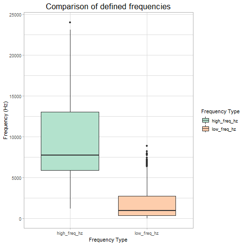

Bird_calls_of_Chernobyl
========================================================
author: Sara T and Stephanie Tsai
date: 
autosize: true


========================================================
## Packages Used


========================================================
## Loading Data
Database we are using is from "Kendrick, P.; Barçante, L.; Beresford, N.A.; Gashchak, S.; Wood, M.D. (2018). Bird Vocalisation Activity (BiVA) database: annotated soundscapes from the Chernobyl Exclusion Zone. NERC Environmental Information Data Centre. https://doi.org/10.5285/be5639e9-75e9-4aa3-afdd-65ba80352591"
Contains data supplied by Natural Environment Research Council from Open Government License

Clarification: "Buzz" represents insects


========================================================
## Clean up data
Use of skimmr::skim to look if data may contain NAs or nonsense values

```
Skim summary statistics
 n obs: 5196 
 n variables: 9 

-- Variable type:character -------------------------------------------------------------------------------------------
               variable missing complete    n min max empty n_unique
 Additional information    4134     1062 5196   1  89     0       59
         Sound category       0     5196 5196   4  12     0        3
                   View       0     5196 5196  13  13     0        1

-- Variable type:numeric ---------------------------------------------------------------------------------------------
       variable missing complete    n    mean      sd      p0     p25
 Begin Time (s)       0     5196 5196 5252.14 3000.37    0    2802.4 
        Channel       0     5196 5196    1       0       1       1   
   End Time (s)       0     5196 5196 5263.71 3001.18    1.71 2810.3 
 High Freq (Hz)       0     5196 5196 9254.7  4391.81 1225.5  5923.4 
  Low Freq (Hz)       0     5196 5196 1656.03 1702.74    0     387.1 
      Selection       0     5196 5196  764.7   527.63    1     302.75
     p50      p75     p100     hist
 5178.82  7554.62 11176.09 <U+2586><U+2586><U+2586><U+2587><U+2587><U+2585><U+2585><U+2583>
    1        1        1    <U+2581><U+2581><U+2581><U+2587><U+2581><U+2581><U+2581><U+2581>
 5184.21  7565.57 11184.81 <U+2586><U+2586><U+2586><U+2587><U+2587><U+2585><U+2585><U+2583>
 7724.45 13025.95 24000    <U+2582><U+2587><U+2585><U+2582><U+2583><U+2582><U+2581><U+2581>
  968.6   2769.2   8897.6  <U+2587><U+2582><U+2582><U+2582><U+2581><U+2581><U+2581><U+2581>
  712.5   1145.25  2034    <U+2587><U+2586><U+2586><U+2586><U+2586><U+2583><U+2582><U+2582>
```
========================================================
## Renaming 

```
# A tibble: 6 x 9
  Selection View  Channel begin_time_s end_time_s low_freq_hz high_freq_hz
      <dbl> <chr>   <dbl>        <dbl>      <dbl>       <dbl>        <dbl>
1         1 Spec~       1        0           1.71       2986.        5696.
2         2 Spec~       1        0.335       1.83       5752.       15119.
3         3 Spec~       1        0.346       1.79          0         3574.
4         4 Spec~       1        6.85        8.72       4652        13639.
5         5 Spec~       1        7.52       14.9        2909.        5677.
6         6 Spec~       1       14.1        16.2        4863.       13216.
# ... with 2 more variables: sound_category <chr>, info <chr>
```

## Renaming the stored variable

========================================================
## Refining the columns we want to analyze

```
# A tibble: 6 x 5
  begin_time_s end_time_s low_freq_hz high_freq_hz sound_category
         <dbl>      <dbl>       <dbl>        <dbl> <chr>         
1        0           1.71       2986.        5696. Bird          
2        0.335       1.83       5752.       15119. Other animal  
3        0.346       1.79          0         3574. Buzz          
4        6.85        8.72       4652        13639. Other animal  
5        7.52       14.9        2909.        5677. Bird          
6       14.1        16.2        4863.       13216. Other animal  
```
========================================================
## Clean Data

All Animals included

```
# A tibble: 6 x 7
  begin_time_s end_time_s sound_category type  frequency duration
         <dbl>      <dbl> <chr>          <chr>     <dbl>    <dbl>
1        0           1.71 Bird           low_~     2986.     1.71
2        0.335       1.83 Other animal   low_~     5752.     1.49
3        0.346       1.79 Buzz           low_~        0      1.44
4        6.85        8.72 Other animal   low_~     4652      1.87
5        7.52       14.9  Bird           low_~     2909.     7.42
6       14.1        16.2  Other animal   low_~     4863.     2.10
# ... with 1 more variable: animal_type <chr>
```
========================================================

### Questions
## 1. What is the frequency range of each animal type?


========================================================


========================================================

From this graph, we saw that Buzz (aka insects) had the lowest median of frequencies and the greatest outliers. Birds have a median frequency of less than 5000 Hz and most of the frequencies are around that point. We can not draw much of a conclusion from other animals because it is a mixture of all different unknown sounds.

========================================================

## 2. To further clarify what we are seeing, we divided these sounds by high and low frequency.


========================================================

This graph is unexpected because we expected more of the buzz sounds to be on the low frequency end, but the data says that most are categorized on the high frequency end. It is hard to tell why this is the case, so we wil count how many data points make up the low frequency for insects.
========================================================

## 3. Counting data points for low freqeuncy insects


========================================================
This tells us there are a lot of points on 0 Hz, so our initial boxplot is misleading because it looks like there are not many points on low frequencies. 

========================================================
## So is this the problem we see in all other animal types?


========================================================

## 4. So what do the labels low frequency and high frequency mean?



========================================================

Now we see there is significant overlap between what is considered low and high frequency. Because of this issue, the labels are possibly arbitrary. The high frequency range dips into the low frequency and vice versa. We cannot rely on their labels, so we will only use the raw frequency observations.

========================================================
## 5. Total number of organisms recorded in Chernobyl per animal type


This tells us how many individuals were recorded. There are many more birds than any other animal.

========================================================

## 6. Is there a relationship between frequency range, recording duration, and animal type?


========================================================

We see that birds have a frequency range between a little above 0-17500 Hz and have a call duration between about 0-100 seconds. Insects have a slightly higher frequency range than birds, but they have shorter call durations. Other animals have the greatest frequency range and can be divided into a low frequency or high frequency sound. They also have greater call durations than birds or insects.


========================================================


