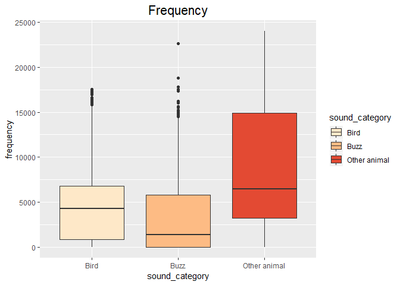
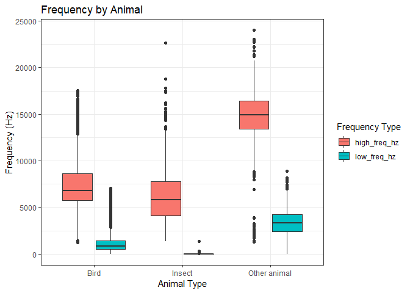
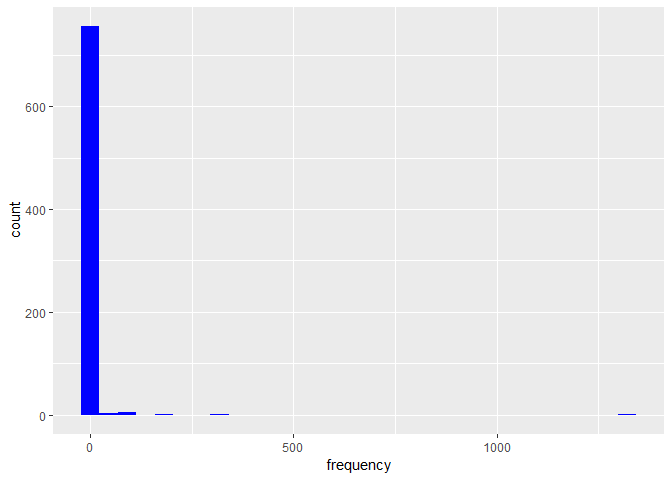
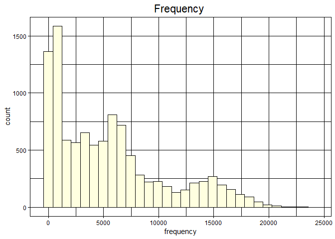
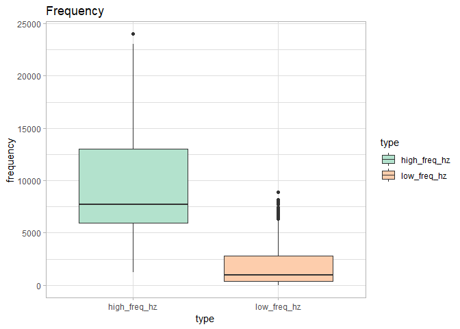
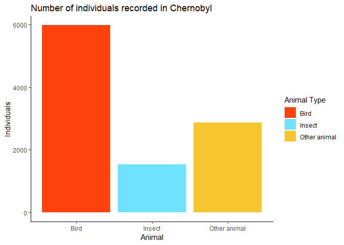
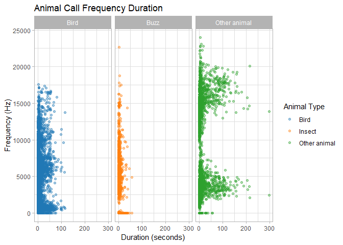

## Packages Used

```r
library(tidyverse)
```

```
## -- Attaching packages ------------------------------------------------------------------------------ tidyverse 1.2.1 --
```

```
## v ggplot2 3.1.0     v purrr   0.3.0
## v tibble  2.0.1     v dplyr   0.7.8
## v tidyr   0.8.2     v stringr 1.3.1
## v readr   1.3.1     v forcats 0.3.0
```

```
## -- Conflicts --------------------------------------------------------------------------------- tidyverse_conflicts() --
## x dplyr::filter() masks stats::filter()
## x dplyr::lag()    masks stats::lag()
```

```r
library(skimr)
library(paletteer)
```
## Loading Data
Database we are using is from "Kendrick, P.; Barçante, L.; Beresford, N.A.; Gashchak, S.; Wood, M.D. (2018). Bird Vocalisation Activity (BiVA) database: annotated soundscapes from the Chernobyl Exclusion Zone. NERC Environmental Information Data Centre. https://doi.org/10.5285/be5639e9-75e9-4aa3-afdd-65ba80352591"
Contains data supplied by Natural Environment Research Council from Open Government License

Clarification: "Buzz" represents insects


```r
call_data <- read_csv("C:/Users/Stephanie T/Desktop/FRS_417/stephanie_scripts_tests/complete_BirdCall_data_table.csv")
```

```
## Parsed with column specification:
## cols(
##   Selection = col_double(),
##   View = col_character(),
##   Channel = col_double(),
##   `Begin Time (s)` = col_double(),
##   `End Time (s)` = col_double(),
##   `Low Freq (Hz)` = col_double(),
##   `High Freq (Hz)` = col_double(),
##   `Sound category` = col_character(),
##   `Additional information` = col_character()
## )
```
## Clean up data
Use of skimmr::skim to look if data may contain NAs or nonsense values

```r
skim(call_data)
```

```
## Skim summary statistics
##  n obs: 5196 
##  n variables: 9 
## 
## -- Variable type:character --------------------------------------------------------------------------------------------
##                variable missing complete    n min max empty n_unique
##  Additional information    4134     1062 5196   1  89     0       59
##          Sound category       0     5196 5196   4  12     0        3
##                    View       0     5196 5196  13  13     0        1
## 
## -- Variable type:numeric ----------------------------------------------------------------------------------------------
##        variable missing complete    n    mean      sd      p0     p25
##  Begin Time (s)       0     5196 5196 5252.14 3000.37    0    2802.4 
##         Channel       0     5196 5196    1       0       1       1   
##    End Time (s)       0     5196 5196 5263.71 3001.18    1.71 2810.3 
##  High Freq (Hz)       0     5196 5196 9254.7  4391.81 1225.5  5923.4 
##   Low Freq (Hz)       0     5196 5196 1656.03 1702.74    0     387.1 
##       Selection       0     5196 5196  764.7   527.63    1     302.75
##      p50      p75     p100     hist
##  5178.82  7554.62 11176.09 <U+2586><U+2586><U+2586><U+2587><U+2587><U+2585><U+2585><U+2583>
##     1        1        1    <U+2581><U+2581><U+2581><U+2587><U+2581><U+2581><U+2581><U+2581>
##  5184.21  7565.57 11184.81 <U+2586><U+2586><U+2586><U+2587><U+2587><U+2585><U+2585><U+2583>
##  7724.45 13025.95 24000    <U+2582><U+2587><U+2585><U+2582><U+2583><U+2582><U+2581><U+2581>
##   968.6   2769.2   8897.6  <U+2587><U+2582><U+2582><U+2582><U+2581><U+2581><U+2581><U+2581>
##   712.5   1145.25  2034    <U+2587><U+2586><U+2586><U+2586><U+2586><U+2583><U+2582><U+2582>
```
Renaming 

```r
call_data <- call_data %>% 
  rename(info = 'Additional information',
         sound_category = 'Sound category',
         begin_time_s = 'Begin Time (s)',
         end_time_s = 'End Time (s)',
         high_freq_hz = 'High Freq (Hz)',
         low_freq_hz = 'Low Freq (Hz)' ) 
```

Renaming the stored variable

```r
bird_calls <- call_data
```

Refining the columns we want to analyze

```r
bird_calls <- bird_calls %>% 
  select(begin_time_s, end_time_s, low_freq_hz, high_freq_hz, sound_category) 

bird_calls
```

```
## # A tibble: 5,196 x 5
##    begin_time_s end_time_s low_freq_hz high_freq_hz sound_category
##           <dbl>      <dbl>       <dbl>        <dbl> <chr>         
##  1        0           1.71       2986.        5696. Bird          
##  2        0.335       1.83       5752.       15119. Other animal  
##  3        0.346       1.79          0         3574. Buzz          
##  4        6.85        8.72       4652        13639. Other animal  
##  5        7.52       14.9        2909.        5677. Bird          
##  6       14.1        16.2        4863.       13216. Other animal  
##  7       18.4        23.6        2597.        5677. Bird          
##  8       20.1        21.9        5958        13427. Other animal  
##  9       26.7        29.0        3489        14273. Other animal  
## 10       33.6        36.2        4969.       13110. Other animal  
## # ... with 5,186 more rows
```

## Clean Data

All Animals included

```r
bird_call_clean <- bird_calls %>% 
  gather(low_freq_hz, high_freq_hz, key = "type", value = "frequency") %>% 
  mutate(duration = end_time_s - begin_time_s) %>% 
  mutate(animal_type = recode(sound_category, Buzz = "Insect")) #renames the default variable so the data is more clear
  

bird_call_clean
```

```
## # A tibble: 10,392 x 7
##    begin_time_s end_time_s sound_category type  frequency duration
##           <dbl>      <dbl> <chr>          <chr>     <dbl>    <dbl>
##  1        0           1.71 Bird           low_~     2986.     1.71
##  2        0.335       1.83 Other animal   low_~     5752.     1.49
##  3        0.346       1.79 Buzz           low_~        0      1.44
##  4        6.85        8.72 Other animal   low_~     4652      1.87
##  5        7.52       14.9  Bird           low_~     2909.     7.42
##  6       14.1        16.2  Other animal   low_~     4863.     2.10
##  7       18.4        23.6  Bird           low_~     2597.     5.14
##  8       20.1        21.9  Other animal   low_~     5958      1.84
##  9       26.7        29.0  Other animal   low_~     3489      2.38
## 10       33.6        36.2  Other animal   low_~     4969.     2.58
## # ... with 10,382 more rows, and 1 more variable: animal_type <chr>
```


## Questions
1. What is the frequency range of each animal type?

```r
bird_call_clean %>% 
  ggplot(aes(x=animal_type, y=frequency, fill=animal_type))+
  geom_boxplot(position="dodge")+
  
  scale_fill_brewer(palette = "OrRd")+
  labs(title = "Frequency",
       x = "Animal Type",
       y = "Frequency (Hz)") +
  theme_light() +
  theme(plot.title = element_text(size=rel(1.5), hjust=0.5))
```

<!-- -->

From this graph, we saw that Buzz (aka insects) had the lowest median of frequencies and the greatest outliers. Birds have a median frequency of less than 5000 Hz and most of the frequencies are around that point. We can not draw much of a conclusion from other animals because it is a mixture of all different unknown sounds.

2. To further clarify what we are seeing, we divided these sounds by high and low frequency.

```r
bird_call_clean %>% 
  group_by(type) %>% 
  ggplot(aes(x = animal_type, y = frequency, fill = type)) +
  geom_boxplot() +
  labs(title = "Frequency by Animal",
       x = "Animal Type",
       y = "Frequency (Hz)",
       fill = "Frequency Type") +
  theme_bw()
```

<!-- -->
This graph is unexpected because we expected more of the buzz sounds to be on the low frequency end, but the data says that most are categorized on the high frequency end. It is hard to tell why this is the case, so we wil count how many data points make up the low frequency for insects.

3. Counting data points for low freqeuncy insects

```r
bird_call_clean %>% 
  filter(sound_category == "Buzz" & type == "low_freq_hz") %>% 
  ggplot(aes(x = frequency)) +
  geom_histogram(fill = "blue")
```

```
## `stat_bin()` using `bins = 30`. Pick better value with `binwidth`.
```

<!-- -->
This tells us there are a lot of points on 0 Hz, so our initial boxplot is misleading because it looks like there are not many points on low frequencies. 

So is this the problem we see in all other animal types?

```r
bird_call_clean %>% 
  ggplot(aes(x=frequency))+
  geom_histogram(fill="lightyellow", color="black")+
  labs(title="Frequency ")+
  theme_linedraw()+
  theme(plot.title = element_text(size=rel(1.5), hjust=0.5))
```

```
## `stat_bin()` using `bins = 30`. Pick better value with `binwidth`.
```

<!-- -->


4. So what do the labels low frequency and high frequency mean?

```r
bird_call_clean %>% 
  ggplot(aes(x=type, y=frequency, fill=type))+
  geom_boxplot(position="dodge")+
  theme(legend.position = "right")+
  scale_fill_brewer(palette = "Pastel2")+
  labs(title = "Frequency")+
  theme_light()
```

<!-- -->
Now we see there is significant overlap between what is considered low and high frequency. Because of this issue, the labels are possibly arbitrary. The high frequency range dips into the low frequency and vice versa. We cannot rely on their labels, so we will only use the raw frequency observations.

5. Total number of organisms recorded in Chernobyl per animal type

```r
bird_call_clean %>% 
  ggplot(aes(x = animal_type))+
  geom_bar(aes(fill = animal_type)) +
  scale_fill_paletteer_d(ggsci, legacy_tron) +
  theme_classic() +
  labs(title = "Number of individuals recorded in Chernobyl",
       x = "Animal",
       y = "Individuals",
       fill = "Animal Type")
```

<!-- -->
This tells us how many individuals were recorded. There are many more birds than any other animal.


6. Is there a relationship between frequency range, recording duration, and animal type?

```r
bird_call_clean %>% 
  group_by(sound_category) %>% 
  ggplot(aes(x = duration, y = frequency)) +
  geom_point(alpha = 0.4, aes(color = animal_type)) +
  scale_color_paletteer_d(ggsci, palette = category10_d3, direction = 1) +
  facet_wrap(~sound_category) +
  theme_light() +
  labs(title = "Animal Call Frequency Duration",
       x = "Duration (seconds)",
       y = "Frequency (Hz)",
       color = "Animal Type")  #double check units
```

<!-- -->

We see that birds have a frequency range between a little above 0-17500 Hz and have a call duration between about 0-100 seconds.
[add interpretation here]


It is hard to see what is happening in the other animals, so we made graphs to clarify the relationship of the frequency and duration.

7. Other animal call frequency with respect to time and duration of call


```r
# bird_only %>% 
#   filter(type == "low_freq_hz") %>% 
#   ggplot(aes(x = begin_time_s, y = frequency, color = duration)) +
#   geom_point(alpha = 0.6) +
#   scale_color_paletteer_c("harrypotter", "ronweasley", direction = -1) +
#   theme_bw()+
#   labs(title = "Low Frequency Duration over time",
#        x = "Time (s)",
#        y = "Frequency",
#        color = "Duration of Call (s)")
```


```r
# bird_only %>% 
#   filter(type == "high_freq_hz") %>% 
#   ggplot(aes(x = begin_time_s, y = frequency, color = duration)) +
#   geom_point(alpha = 0.6) +
#   scale_color_paletteer_c("viridis", "plasma", direction = -1) +
#   theme_bw()+
#   labs(title = "High Frequency Duration over time",
#        x = "Time (s)",
#        y = "Frequency",
#        color = "Duration of Call (s)")
```


