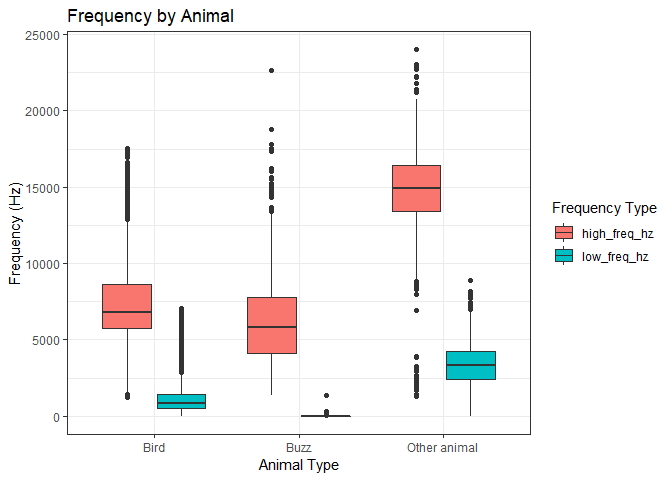
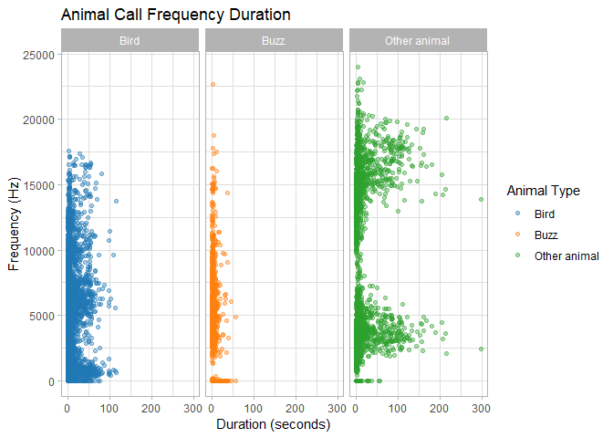
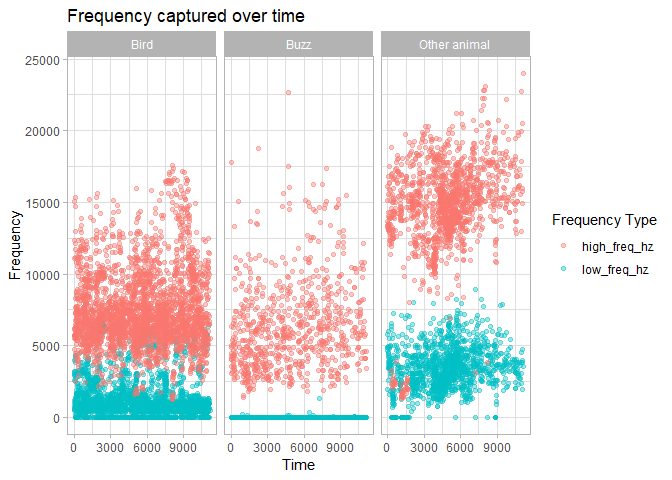
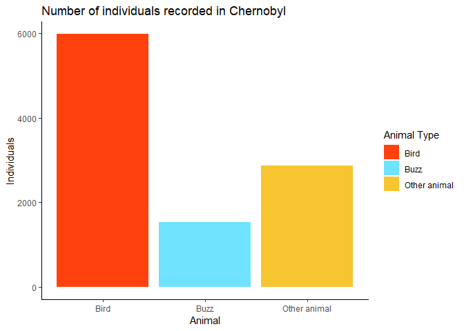
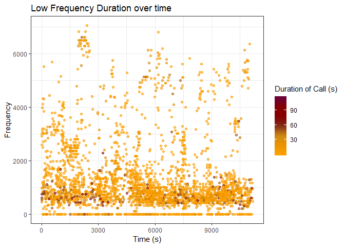
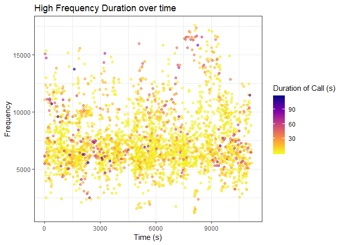
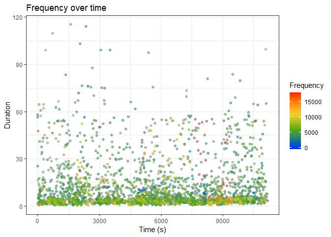

## Packages Used

```r
library(tidyverse)
```

```
## -- Attaching packages ------------------------------------------------------ tidyverse 1.2.1 --
```

```
## v ggplot2 3.1.0     v purrr   0.3.0
## v tibble  2.0.1     v dplyr   0.7.8
## v tidyr   0.8.2     v stringr 1.3.1
## v readr   1.3.1     v forcats 0.3.0
```

```
## -- Conflicts --------------------------------------------------------- tidyverse_conflicts() --
## x dplyr::filter() masks stats::filter()
## x dplyr::lag()    masks stats::lag()
```

```r
library(skimr)
library(paletteer)
```
## Loading Data
Database we are using is from "Kendrick, P.; Barçante, L.; Beresford, N.A.; Gashchak, S.; Wood, M.D. (2018). Bird Vocalisation Activity (BiVA) database: annotated soundscapes from the Chernobyl Exclusion Zone. NERC Environmental Information Data Centre. https://doi.org/10.5285/be5639e9-75e9-4aa3-afdd-65ba80352591"
Contains data supplied by Natural Environment Research Council from Open Government License

Clarification: "Buzz" represents insects


```r
call_data <- read_csv("C:/Users/Stephanie T/Desktop/FRS_417/stephanie_scripts_tests/complete_BirdCall_data_table.csv")
```

```
## Parsed with column specification:
## cols(
##   Selection = col_double(),
##   View = col_character(),
##   Channel = col_double(),
##   `Begin Time (s)` = col_double(),
##   `End Time (s)` = col_double(),
##   `Low Freq (Hz)` = col_double(),
##   `High Freq (Hz)` = col_double(),
##   `Sound category` = col_character(),
##   `Additional information` = col_character()
## )
```
## Clean up data
Use of skimmr::skim to look if data may contain NAs or nonsense values

```r
skim(call_data)
```

```
## Skim summary statistics
##  n obs: 5196 
##  n variables: 9 
## 
## -- Variable type:character --------------------------------------------------------------------
##                variable missing complete    n min max empty n_unique
##  Additional information    4134     1062 5196   1  89     0       59
##          Sound category       0     5196 5196   4  12     0        3
##                    View       0     5196 5196  13  13     0        1
## 
## -- Variable type:numeric ----------------------------------------------------------------------
##        variable missing complete    n    mean      sd      p0     p25
##  Begin Time (s)       0     5196 5196 5252.14 3000.37    0    2802.4 
##         Channel       0     5196 5196    1       0       1       1   
##    End Time (s)       0     5196 5196 5263.71 3001.18    1.71 2810.3 
##  High Freq (Hz)       0     5196 5196 9254.7  4391.81 1225.5  5923.4 
##   Low Freq (Hz)       0     5196 5196 1656.03 1702.74    0     387.1 
##       Selection       0     5196 5196  764.7   527.63    1     302.75
##      p50      p75     p100     hist
##  5178.82  7554.62 11176.09 <U+2586><U+2586><U+2586><U+2587><U+2587><U+2585><U+2585><U+2583>
##     1        1        1    <U+2581><U+2581><U+2581><U+2587><U+2581><U+2581><U+2581><U+2581>
##  5184.21  7565.57 11184.81 <U+2586><U+2586><U+2586><U+2587><U+2587><U+2585><U+2585><U+2583>
##  7724.45 13025.95 24000    <U+2582><U+2587><U+2585><U+2582><U+2583><U+2582><U+2581><U+2581>
##   968.6   2769.2   8897.6  <U+2587><U+2582><U+2582><U+2582><U+2581><U+2581><U+2581><U+2581>
##   712.5   1145.25  2034    <U+2587><U+2586><U+2586><U+2586><U+2586><U+2583><U+2582><U+2582>
```

Renaming 

```r
call_data <- call_data %>% 
  rename(info = 'Additional information',
         sound_category = 'Sound category',
         begin_time_s = 'Begin Time (s)',
         end_time_s = 'End Time (s)',
         high_freq_hz = 'High Freq (Hz)',
         low_freq_hz = 'Low Freq (Hz)' ) 
```

Renaming the stored variable

```r
bird_calls <- call_data
```

Refining the columns we want to analyze

```r
bird_calls <- bird_calls %>% 
  select(begin_time_s, end_time_s, low_freq_hz, high_freq_hz, sound_category) 

bird_calls
```

```
## # A tibble: 5,196 x 5
##    begin_time_s end_time_s low_freq_hz high_freq_hz sound_category
##           <dbl>      <dbl>       <dbl>        <dbl> <chr>         
##  1        0           1.71       2986.        5696. Bird          
##  2        0.335       1.83       5752.       15119. Other animal  
##  3        0.346       1.79          0         3574. Buzz          
##  4        6.85        8.72       4652        13639. Other animal  
##  5        7.52       14.9        2909.        5677. Bird          
##  6       14.1        16.2        4863.       13216. Other animal  
##  7       18.4        23.6        2597.        5677. Bird          
##  8       20.1        21.9        5958        13427. Other animal  
##  9       26.7        29.0        3489        14273. Other animal  
## 10       33.6        36.2        4969.       13110. Other animal  
## # ... with 5,186 more rows
```


## Clean Data

All Animals included

```r
bird_call_clean <- bird_calls %>% 
  gather(low_freq_hz, high_freq_hz, key = "type", value = "frequency") %>% 
  mutate(duration = end_time_s - begin_time_s)
  

bird_call_clean
```

```
## # A tibble: 10,392 x 6
##    begin_time_s end_time_s sound_category type        frequency duration
##           <dbl>      <dbl> <chr>          <chr>           <dbl>    <dbl>
##  1        0           1.71 Bird           low_freq_hz     2986.     1.71
##  2        0.335       1.83 Other animal   low_freq_hz     5752.     1.49
##  3        0.346       1.79 Buzz           low_freq_hz        0      1.44
##  4        6.85        8.72 Other animal   low_freq_hz     4652      1.87
##  5        7.52       14.9  Bird           low_freq_hz     2909.     7.42
##  6       14.1        16.2  Other animal   low_freq_hz     4863.     2.10
##  7       18.4        23.6  Bird           low_freq_hz     2597.     5.14
##  8       20.1        21.9  Other animal   low_freq_hz     5958      1.84
##  9       26.7        29.0  Other animal   low_freq_hz     3489      2.38
## 10       33.6        36.2  Other animal   low_freq_hz     4969.     2.58
## # ... with 10,382 more rows
```
Only Birds

```r
bird_only <- bird_call_clean %>% 
  filter(sound_category == "Bird") 

bird_only
```

```
## # A tibble: 5,984 x 6
##    begin_time_s end_time_s sound_category type        frequency duration
##           <dbl>      <dbl> <chr>          <chr>           <dbl>    <dbl>
##  1         0          1.71 Bird           low_freq_hz     2986.    1.71 
##  2         7.52      14.9  Bird           low_freq_hz     2909.    7.42 
##  3        18.4       23.6  Bird           low_freq_hz     2597.    5.14 
##  4        33.8       36.5  Bird           low_freq_hz     3183.    2.72 
##  5        40.5       54.9  Bird           low_freq_hz     3967.   14.4  
##  6        42.5       43.5  Bird           low_freq_hz     1191.    0.988
##  7        43.9       50.1  Bird           low_freq_hz     3097.    6.15 
##  8        65.4       66.2  Bird           low_freq_hz     2494.    0.793
##  9        80.4       81.3  Bird           low_freq_hz     3011.    0.874
## 10        92.5       98.5  Bird           low_freq_hz     2701.    6.07 
## # ... with 5,974 more rows
```


## Questions
1. Which category has the greatest frequency variation?

```r
bird_call_clean %>% 
  group_by(type) %>% 
  ggplot(aes(x = sound_category, y = frequency, fill = type)) +
  geom_boxplot() +
  labs(title = "Frequency by Animal",
       x = "Animal Type",
       y = "Frequency (Hz)",
       fill = "Frequency Type") +
  theme_bw()
```

<!-- -->


2. Is there a relationship between frequency range and recording duration?

```r
bird_call_clean %>% 
  group_by(sound_category) %>% 
  ggplot(aes(x = duration, y = frequency)) +
  geom_point(alpha = 0.4, aes(color = sound_category)) +
  scale_color_paletteer_d(ggsci, palette = category10_d3, direction = 1) +
  facet_wrap(~sound_category) +
  theme_light() +
  labs(title = "Animal Call Frequency Duration",
       x = "Duration (seconds)",
       y = "Frequency (Hz)",
       color = "Animal Type")  #double check units
```

<!-- -->

3. Trend across time

```r
bird_call_clean %>% 
  ggplot(aes(x = begin_time_s, y = frequency)) +
  geom_point(alpha = 0.4, aes(color = type)) +
  facet_wrap(~sound_category) +
  labs(title = "Frequency captured over time",
       x = "Time",
       y = "Frequency",
       color = "Frequency Type") +
  theme_light()
```

<!-- -->


4. Total number of organisms recorded in Chernobyl

```r
bird_call_clean %>% 
  ggplot(aes(x = sound_category))+
  geom_bar(aes(fill = sound_category)) +
  scale_fill_paletteer_d(ggsci, legacy_tron) +
  theme_classic() +
  labs(title = "Number of individuals recorded in Chernobyl",
       x = "Animal",
       y = "Individuals",
       fill = "Animal Type")
```

<!-- -->

5. Bird Call Frequency with respect to time and duration of call

```r
bird_only %>% 
  filter(type == "low_freq_hz") %>% 
  ggplot(aes(x = begin_time_s, y = frequency, color = duration)) +
  geom_point(alpha = 0.6) +
  scale_color_paletteer_c("harrypotter", "ronweasley", direction = -1) +
  theme_bw()+
  labs(title = "Low Frequency Duration over time",
       x = "Time (s)",
       y = "Frequency",
       color = "Duration of Call (s)")
```

<!-- -->


```r
bird_only %>% 
  filter(type == "high_freq_hz") %>% 
  ggplot(aes(x = begin_time_s, y = frequency, color = duration)) +
  geom_point(alpha = 0.6) +
  scale_color_paletteer_c("viridis", "plasma", direction = -1) +
  theme_bw()+
  labs(title = "High Frequency Duration over time",
       x = "Time (s)",
       y = "Frequency",
       color = "Duration of Call (s)")
```

<!-- -->


```r
bird_only %>% 
  
  ggplot(aes(x = begin_time_s, y = duration, color = frequency)) +
  geom_point(alpha = 0.3) +
  scale_color_paletteer_c("pals", "kovesi.rainbow_bgyr_35_85_c72", direction = 1, ) +
  theme_bw()+
  labs(title = "Frequency over time",
       x = "Time (s)",
       y = "Duration",
       color = "Frequency")
```

<!-- -->


